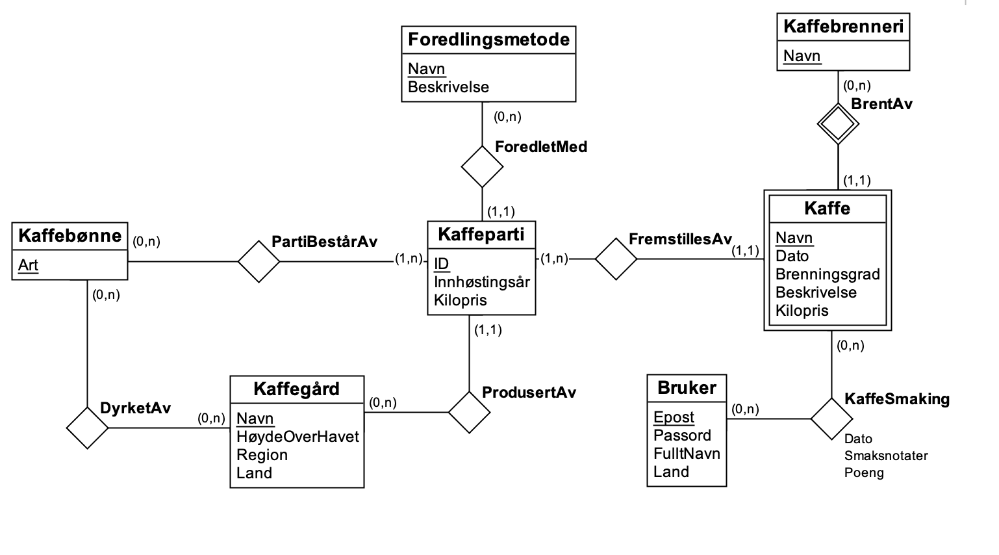

# TDT4145-project

## Kriterier (TODO: FJERN DETTE)
DB1
1. Bruk av entiteter, relasjoner og attributter. Disse konseptene skal anvendes på en 
hensiktsmessig måte, og antallet entiteter og relasjoner skal være rimelig
2. Bruk av nøkler, herunder naturlige og genererte.
3. Bruk av restriksjoner, f.eks. kardinaliteter, i modellen. Er disse anvendt på korrekt vis?
4. Oversetting til SQL-tabeller. Korrekt bruk av SQL, herunder attributtdomener, (fremmed-
)nøkkelrestriksjoner og UNIQUE. Forståelse av normalformer, inkludert 4NF.
5. Beskrivelsen av hvordan brukerhistoriene passer inn med tabellene, hvilke tabeller som 
brukes i hvilke brukerhistorier. Inneholder tabellene all nødvendig informasjon?
6. Dokumentene skal være konsise og figurene enkle å forstå.

## ER-modell
> TODO: må laste opp rett versjon av bildet:)


### Antakelser
- Forskjellige kaffegårder kan ikke ha samme navn.
- Forskjellige kaffebrennerier kan ikke ha samme navn.
- Kaffe: Flere kaffebrennerier kan navngi kaffen sin likt, derfor er Kaffe en svak klasse.

## Relasjonsdatabasemodeller
- **Kaffebønne** (<ins>Art</ins>) 

  *Navn på arten er nøkkel til Kaffebønne. Hver art har et unikt navn.*
> TODO: Skal vi lage total og disjunkt spesialisering med de tre typene?
- **Kaffegård** (<ins>Navn</ins>, HøydeOverHavet, Land, Region)
  *Navn er nøkkel til Kaffegård, og vi antar dermed at ingen kaffegårder har samme navn.* 
> TODO: Skal vi fjerne antakelser når vi har det med her, eller skal det med begge steder?
- **Kaffeparti** (<ins>ID</ins>, Innhøstingsår, Kilopris, KaffegårdNavn, ForedlingsmetodeNavn)
  *ID er nøkkel til Kaffeparti, og velges unikt når et kaffeparti opprettes.*
  *KaffegårdNavn er fremmednøkkel mot Kaffegård (ProdusertAv).*
  *ForedlingsmetodeNavn er fremmednøkkel mot Foredlingsmetode (ForedletMed).*
- **Kaffe** (<ins>Navn</ins>, <ins>Dato</ins>, Brenningsgrad, Beskrivelse, Kilopris, KaffebrenneriNavn, KaffepartiID)
  *Navn og Dato er svake nøkler for Kaffe.*
  *Kaffebrennerinavn er identifiserende fremmednøkkel mot Kaffebrenneri (BrentAv).*
  *KaffepartiID er fremmednøkkel mot Kaffeparti (FremstillesAv).*
- **Kaffebrenneri** (<ins>Navn</ins>)
  *Navn er nøkkel til Kaffebrenneri, og det er antatt at ingen Kaffebrenneri har samme navn.*
- **Bruker**(<ins>Epost</ins>, Passord, FulltNavn, Land)
  *Epost er nøkkel til bruker.*
- **Foredlingsmetode**(<ins>Navn</ins>, Beskrivelse)
  *Navn på foredlingsmetode er nøkkel til Foredlingsmetode.*
- **Kaffesmaking** (<ins>Epost</ins>, <ins>KaffebrenneriNavn</ins>, <ins>KaffeNavn</ins>, <ins>KaffeDato</ins>, Smaksnotater, Poeng, Dato)
  *KaffebrenneriNavn, KaffeNavn og KaffeDato er fremmednøkler mot Kaffe.*
  *Epost er fremmednøkkel mot Bruker.*
  *Epost, KaffebrenneriNavn, KaffeNavn og KaffeDato utgjør nøkkelen til Kaffesmaking.*
- **DyrketAv** (<ins>KaffebønneArt</ins>, <ins>KaffegårdNavn</ins>)
  *KaffebønneArt er fremmednøkkel mot Kaffebønne.*
  *KaffegårdNavn er fremmednøkkel mot Kaffegård.*
  *Sammen utgjør de nøkkelen til DyrketAv.*
- **PartiBestårAv** (<ins>KaffebønneArt</ins>, <ins>KaffepartiID</ins>)
  *KaffebønneArt er fremmednøkkel mot Kaffebønne.*
  *KaffepartiID er fremmednøkkel mot Kaffeparti.*
  *Sammen utgjør de nøkkelen til PartiBestårAv.*

## Normalformer

### Kaffebønne
Ikke-trivielle funksjonelle avhengigheter og fler-verdi-avhengigheter:
- Ingen.

Supernøkler: (Art)

Oppfyller 4NF fordi det ikke er noen ikke-trivielle funksjonelle avhengigheter eller fler-verdi-avhengigheter.

### Kaffegård
Ikke-trivielle funksjonelle avhengigheter og fler-verdi-avhengigheter:
- Navn $\rightarrow$ HøydeOverHavet, Land, Region
- Land $\twoheadrightarrow$ Region

Supernøkler: (Navn)

Oppfyller 2NF fordi ingen ikke-nøkkel attributter er delvis avhengig av en (kandidat-)nøkkel. 
Oppfyller også 3NF og BCNF fordi ingen ikke-nøkkelattributter er avhengig av andre ikke-nøkkelattributter.
Oppfyller ikke 4NF fordi Land ikke er en supernøkkel.

*Konklusjon: Tabellen er på BCNF.*

### Kaffeparti
Ikke-trivielle funksjonelle avhengigheter og fler-verdi-avhengigheter:
- ID $\rightarrow$ Innhøstingsår, KaffegårdNavn, ForedlingsmetodeNavn

Supernøkler: (ID)

Oppfyller 2NF fordi ingen ikke-nøkkel attributter er delvis avhengig av en (kandidat-)nøkkel. 
Videre oppfylles også 3NF og BCNF fordi ingen ikke-nøkkelattributter er avhengig av andre ikke-nøkkelattributter.
4NF oppfylles fordi det er ingen fler-verdi-avhengigheter.

*Konklusjon: Tabellen er på 4NF.*

### Kaffe
Ikke-trivielle funksjonelle avhengigheter og fler-verdi-avhengigheter:
- KaffebrenneriNavn, Navn, Dato $\rightarrow$ Brenningsgrad, Beskrivelse, Kilopris, KaffepartiID

Supernøkler: (KaffebrenneriNavn, Navn, Dato)

Oppfyller 2NF fordi ingen ikke-nøkkel attributter er delvis avhengig av en (kandidat-)nøkkel. 
Videre oppfylles også 3NF og BCNF fordi ingen ikke-nøkkelattributter er avhengig av andre ikke-nøkkelattributter.
4NF oppfylles fordi det er ingen fler-verdi-avhengigheter.

*Konklusjon: Tabellen er på 4NF.*

### Kaffebrenneri
Ikke-trivielle funksjonelle avhengigheter og fler-verdi-avhengigheter:
- Ingen, kun ett attributt

Supernøkler: (Navn)

Oppfyller 4NF fordi det ikke er noen ikke-trivielle funksjonelle avhengigheter eller fler-verdi-avhengigheter.

*Konklusjon: Tabellen er på 4NF.*

### Bruker
Ikke-trivielle funksjonelle avhengigheter og fler-verdi-avhengigheter:
- Epost $\rightarrow$ Passord, FulltNavn, Land

Supernøkkel: (Epost)

Oppfyller 2NF fordi ingen ikke-nøkkel attributter er delvis avhengig av en (kandidat-)nøkkel. Videre oppfylles også 3NF og BCNF fordi ingen ikke-nøkkelattributter er avhengig av andre ikke-nøkkelattributter. Oppfyller 4NF fordi det ikke er noen ikke-trivielle fler-verdi-avhengigheter.

*Konklusjon: Tabellen er på 4NF.*

### Kaffesmaking
Ikke-trivielle funksjonelle avhengigheter og fler-verdi-avhengigheter:
- Epost, Kaffebrenneri, KaffeNavn, KaffeDato $\rightarrow$ Smaksnotater, Poeng

> TODO: DATO

Supernøkler: (Epost, KaffeNavn)

Oppfyller 2NF fordi ingen ikke-nøkkel attributter er delvis avhengig av en (kandidat-)nøkkel. Videre oppfylles også 3NF og BCNF fordi ingen ikke-nøkkelattributter er avhengig av andre ikke-nøkkelattributter. Oppfyller 4NF fordi det ikke er noen ikke-trivielle fler-verdi-avhengigheter.

*Konklusjon: Tabellen er på 4NF.*

### DyrketAv
Ikke-trivielle funksjonelle avhengigheter og fler-verdi-avhengigheter:
- Ingen.

Supernøkkel: (KaffebønneArt, KaffegårdNavn)

Oppfyller 2NF fordi ingen ikke-nøkkel attributter er delvis avhengig av en (kandidat-)nøkkel. Videre oppfylles også 3NF og BCNF fordi ingen ikke-nøkkelattributter er avhengig av andre ikke-nøkkelattributter. Oppfyller 4NF fordi det ikke er noen ikke-trivielle funksjonelle avhengigheter eller fler-verdi-avhengigheter.

*Konklusjon: Tabellen er på 4NF.*

### PartiBestårAv
Ikke-trivielle funksjonelle avhengigheter og fler-verdi-avhengigheter:
- Ingen funksjonelle avhengigheter.

Oppfyller 2NF fordi ingen ikke-nøkkel attributter er delvis avhengig av en (kandidat-)nøkkel. Videre oppfylles også 3NF og BCNF fordi ingen ikke-nøkkelattributter er avhengig av andre ikke-nøkkelattributter. Oppfyller 4NF fordi det ikke er noen ikke-trivielle funksjonelle avhengigheter eller fler-verdi-avhengigheter.

*Konklusjon: Tabellen er på 4NF.*

## Hvordan brukerhistoriene tilfredsstilles

### Brukerhistorie 1 kan implementeres slik i systemet:

**Kaffe** ('Vinterkaffe', '20.01.2022', 'lysbrent', 'En velsmakende og kompleks kaffe for mørketiden', 600kr, 'Jacobsen & Svart', 1)
  TODO: Pris og valuta?

**Kaffebrenneri** ('Jacobsen & Svart')

**Kaffeparti** (1, 2021, 8 USD, 'Bærtørket')
  TODO: Pris og valuta?

**Kaffebønne** ('Coffea arabica')

**Kaffegård** ('Nombre Dios', 1500, 'Santa Ana', 'El Salvador')

**Bruker** ('ola@nordmann.no', 'Passord', 'Ola Nordmann', 'Norge')

**Kaffesmaking** ('ola@nordmann.no', 'Jacobsen & Svart', 'Vinterkaffe', '20.01.2022', 'Wow - en odyssé for smaksløkene: sitrusskall, melkesjokolade, aprikos!', 10, null)
  *Brukerhistorien sier ingenting om smaksdato --> null

**DyrketAv** ('Coffea arabica , 'Nombre de Dios')

**PartiBestårAv** ('Coffea arabica', 1)

**Foredlingsmetode** ('Bærtørket', null)

Her er hele brukerhistorien lagt til i tabellene våre. Vi kan da se at modellen vår tilfredsstiller brukerhistorie 1.

### Brukerhistorie 2
I systemet vårt kan man få en liste over hvilke brukere som har smakt flest unike kaffer så langt i år ved å gruppere kaffesmakinger etter bruker-epost, hvor dato er i 2022. Deretter sjekker man hvor mange smakinger de har på unike kaffer ved å telle unike fremmednøkler til Kaffe. Til slutt sorterer du på antall synkende, og returnerer brukerens fulle navn og antallet kaffer de har smakt.
> TODO: er COUNT(*) riktig?
```sql
SELECT FulltNavn, COUNT(*) AS Antall
FROM Kaffesmaking INNER JOIN Bruker USING (Epost)
WHERE Dato LIKE '%2022'
GROUP BY Epost
ORDER BY Antall DESC
```

### Brukerhistorie 3
> TODO: Gjøre ferdig denne

Vi joiner Kaffesmaking med Kaffe naturlig (på Kaffes nøkkelattributter). Deretter finner vi gjennomsnitt av Poeng i KaffeSmaking (og kaller dette gjennomsnittsscore), gruppert utifra ulike kaffer. Returnerer KaffebrenneriNavn, Kaffe navn, pris og gjennomsnittsscore.
```sql
SELECT Kaffe.KaffebrenneriNavn,
Kaffe.Kilopris, AVG(Poeng) AS GjPoeng  
FROM Kaffesmaking NATURAL JOIN Kaffe AS K
GROUP BY K.KaffebrenneriNavn, K.Navn
```

### Brukerhistorie 4
Vi joiner Kaffe og Kaffesmaking naturlig. Deretter velger vi ut alle kaffer hvor beskrivelsen inneholder 'floral' eller smaksnotater inneholder 'floral'. Returnerer Kaffe.KaffebrenneriNavn og Kaffe.Navn.
```sql
SELECT Kaffe.KaffebrenneriNavn, Kaffe.Navn
FROM Kaffe NATURAL JOIN Kaffesmaking
WHERE Kaffe.Beskrivelse='floral' OR Kaffesmaking.Smaksnotater='floral'
```

### Brukerhistorie 5
Vi joiner Kaffe og Kaffeparti på KaffepartiID=ID. Deretter joiner vi dette med Kaffegård der Kaffeparti.KaffegårdNavn = Kaffegård.Navn. Nå velger vi ut de gårder hvor land er enten 'Rwanda' eller 'Columbia'. Avslutningsvis velger man de radene der Kaffeparti.ForedlingsmetodeNavn ikke er lik 'vasket', før man joiner disse med Kaffe og returnerer Kaffe.Navn og KaffebrenneriNavn.
```sql
SELECT Kaffe.Navn, FerigbrentKaffe.KaffebrenneriNavn
FROM (Kaffe INNER JOIN Kaffeparti) INNER JOIN Kaffegård
WHERE (Kaffe.KaffepartiID=Kaffeparti.ID AND Kaffeparti.KaffegårdNavn=Kaffegård.Navn) AND (Kaffegård.Land='Rwanda' OR Kaffegård.Land='Colombia') AND Kaffeparti.ForedlingsmetodeNavn!='vasket'
```