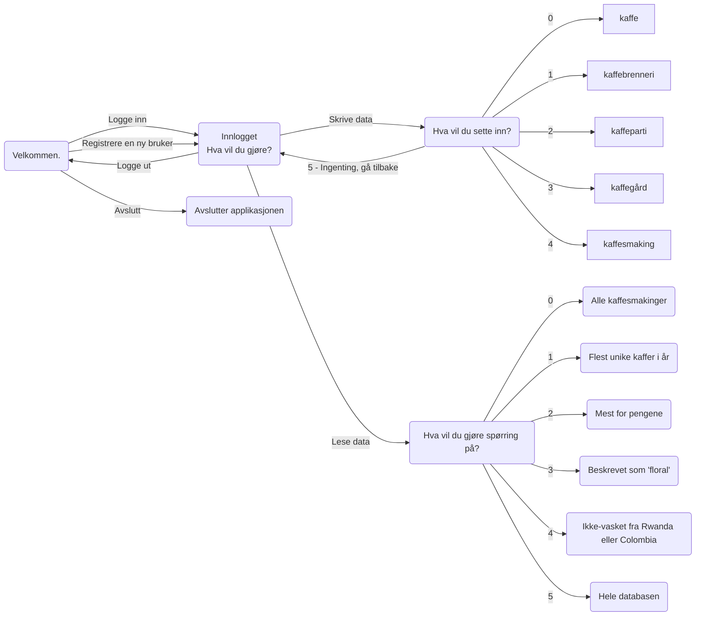
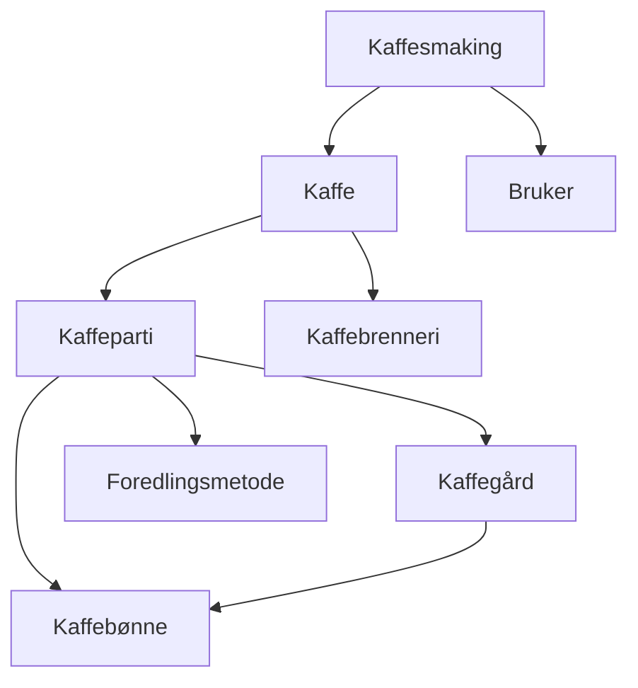

# TDT4145 - DB2 Gruppe 109

| Etternavn  | Fornavn                | E-post                |
| ---------- | ---------------------- | --------------------- |
| Lie        | Karin Sofie Syversveen | kslie@stud.ntnu.no    |
| Stabell    | Karoline Ytreeide      | karoliys@stud.ntnu.no |
| Tenstad    | Magne Erlendsønn       | magneet@stud.ntnu.no  |

## Sjekkliste
- [x] Brukerhistorie 1
- [x] Brukerhistorie 2 med SQL-spørring og data for å teste spørringen
- [x] Brukerhistorie 3 med SQL-spørring og data for å teste spørringen
- [x] Brukerhistorie 4 med SQL-spørring og data for å teste spørringen
- [x] Brukerhistorie 5 med SQL-spørring og data for å teste spørringen
- [x] Notere alle endringer som er gjort fra DB1 (se git history)
- [x] Skrive og begrunne antakelser
- [x] Forklare hvordan programmet kjøres og brukes

## Evalueringskriterier
- [x] En oversikt over hvordan brukerhistoriene er løst.
- [x] Korrekt bruk av SQL i Python.
- [ ] Forståelig og lesbar kode.
- [ ] Konsise og tydelige beskrivelser i dokumentet
- [ ] Det skal være mulig å reprodusere de leverte resultatene ved hjelp av programmet og databasen som er levert.

## Applikasjonsbeskrivelse

### Endringer og antakelser
- Byttet ut æ, ø og å med ae, oe og aa i alle attributtnavn da det ga feilmelding.
- Endret Innhøstingsår fra TEXT til INTEGER for å få rett validering av input.
- Lagt til Beskrivelse-attributt på kaffe.
- Kaffegårder må dyrke minst en kaffebønne.

- I brukerhistorie 2 har vi antatt at brukere som ikke har smakt noen kaffer også skal vises i tabellen.
- En bruker kan kun legge inn én kaffesmaking per kaffe, ettersom statistikk er et viktig formål med applikasjonen.
- Utifra brukerhistorie 1 har vi antatt at en kaffesmaking ikke trenger en smaksdato, og dermed er det naturlig at samme bruker ikke kan legge inn en kaffesmaking på samme kaffe flere ganger.
- Det er antatt at brenningsdatoen på en kaffe ikke er identifiserende, ettersom samme kaffe kan brennes på ulike tidspunkt. 


### Hvordan kjøre programmet

Programmet er skrevet med python 3.10 og er ikke testet for andre versjoner av python.

Installer `pandas` og `tabulate` dersom du ikke allerede har det.
```
pip install pandas
pip install tabulate
```
Gå til `src`-mappen dersom du ikke allerede er der.
```
cd db2/src
```
Kjør følgende kommando for å kjøre programmet.
```
python main.py
```
Kjør følgende kommando for å kjøre automatiske tester.
```
python -m unittest test.py
```
Hver gang det presenteres alternativer, velger man et alternativ ved å skrive nummeret som står foran alternativet, eller selve alternativet.

### Hvordan applikasjonen fungerer


<b>Figur 1: Tilstandsdiagram for applikasjonen</b>

Brukeren får mulighet til å logge inn eller registrere en ny bruker. Ved oppstart må det opprettes en bruker for å få logget inn. Deretter blir man spurt hva man ønsker å gjøre, og får tre alternativer: skrive data, lese data eller avslutte programmet.

Figur 2 viser hvordan ulike objekter i databasen er avhengige av andre objekter. Når man skal skrive inn data for disse tilfellene kan man velge å bruke data som allerede ligger i tabellen, eller legge til ny. Dersom man ønsker å legge til ny data må det også legges til data for eventuelle avhengigheter. Om en bruker for eksempel ønsker å legge til en kaffesmaking, må en kaffe velges eller opprettes. Ved hver avhengighet blir alternativene som ligger i databasen presentert, og det kan velges blant de lagrede eller legges til en ny. 


<b>Figur 2: Avhengigheter mellom tabellene i databasen</b>

## Brukerhistorier

### Brukerhistorie 1
Brukerhistorie 1 går ut på å notere en kaffesmaking, og krever at den aktuelle brukeren er logget inn. Vi registrerer derfor en bruker før vi notererer kaffesmakingen. Der man blir presentert med alternativer velges disse ved å skrive tallet som står foran. Følgende viser hvordan brukerhistorie 1 er implementert.
```
Velkommen til Kaffedatabasen 😊☕   

Hva vil du gjøre?
        (0) Logge inn
        (1) Logge inn som gjest    
        (2) Registrere en ny bruker
        (3) Avslutte
> registrere en ny bruker

Registrer deg med epost, passord, navn og land:

<str> Epost: bruker@ntnu.no
<str> Passord: bruker-passord
<str> Fullt navn: Bruker Bruker                  
<str> Land: Brukerland

✅ Satt inn brukeren ['bruker@ntnu.no', 'bruker-passord', 'Bruker Bruker', 'Brukerland'] 

Registrert og logget inn som bruker@ntnu.no!

Hva vil du gjøre?
        (0) Lese data
        (1) Logge ut
        (2) Skrive data
> skrive data

Hva vil du sette inn?
        (0) Kaffe
        (1) Kaffebrenneri        
        (2) Kaffeparti
        (3) Kaffegård
        (4) Kaffesmaking
        (5) Ingenting, gå tilbake
> kaffesmaking

Hvilken kaffe har du smakt?
        (0) ('Jacobsen & Svart', 'Vinterkaffe', '2022.01.20', 'lysbrent', 'En velsmakende og kompleks kaffe for mørketiden.', 600.0, '0')   
        (1) ('Jacobsen & Svart', 'Diamond Santos', '2021.02.01', 'lysbrent', 'En temmelig stabil og streit kaffe.', 349.0, '1')
        (2) ('Jacobsen & Svart', 'La Palma', '2021.02.01', 'lysbrent', 'Forfriskende og delikat.', 598.0, '2')
        (3) ('Realfagsbrenneriet', 'Data-kaffe', '2021.02.01', 'mørkbrent', 'En kaffe for datateknologi-studenter.', 600.0, '3')
        (4) ('Realfagsbrenneriet', 'Kyb-kaffe', '2022.01.02', 'lysbrent', 'En kaffe for kybernetikk-studenter.', 412.0, '4')
        (5) ('Realfagsbrenneriet', 'Indøk-kaffe', '2022.02.12', 'lysbrent', 'En kaffe for indøk-studenter.', 789.0, '5')
        (6) ('Realfagsbrenneriet', 'I&IKT-kaffe', '2022.03.12', 'mørkbrent', 'En kaffe for ingeniørvitenskap-og-ikt-studenter.', 359.0, '6')
        (7) Ingen av disse
> 0

Fyll inn følgende verdier for kaffesmakingen.

<str> Smaksnotater: Wow - en odyssé for smaksløkene: sitrusskall, melkesjokolade, aprikos!
<int> Poeng: 10
<Date> Smaksdato (yyyy.mm.dd): 2022.03.24

✅ Satt inn kaffesmakingen ['bruker@ntnu.no', 'Jacobsen & Svart', 'Vinterkaffe',
'Wow - en odyssé for smaksløkene: sitrusskall, melkesjokolade, aprikos!', 10, '2022.03.24'] 

Vil du sette inn noe mer?
        (0) Ja
        (1) Nei
> nei

Hva vil du gjøre?
        (0) Lese data
        (1) Logge ut
        (2) Skrive data
> logge ut

Logget ut.

Velkommen til Kaffedatabasen 😊☕

Hva vil du gjøre?
        (0) Logge inn
        (1) Logge inn som gjest
        (2) Registrere en ny bruker
        (3) Avslutte
> avslutte

Takk for nå!
```

Dersom kaffen, kaffebrenneriet, kaffepartiet eller kaffegården ikke allerede er registrert i databasen, får brukeren oppfølgingsspørsmål. Oversikt over avhengighetene er i figur 2. Det er implementert på følgende måte:
```
Hvilken kaffe har du smakt?
        (0) ('Jacobsen & Svart', 'Diamond Santos', '2021.02.01', 'lysbrent', 'En temmelig stabil og streit kaffe.', 349.0, '0')        
        (1) ('Jacobsen & Svart', 'La Palma', '2021.02.01', 'lysbrent', 'Forfriskende og delikat.', 598.0, '1')
        (2) ('Realfagsbrenneriet', 'Data-kaffe', '2021.02.01', 'mørkbrent', 'En kaffe for datateknologi-studenter.', 600.0, '2')       
        (3) ('Realfagsbrenneriet', 'Kyb-kaffe', '2022.01.02', 'lysbrent', 'En kaffe for kybernetikk-studenter.', 412.0, '3')
        (4) ('Realfagsbrenneriet', 'Indøk-kaffe', '2022.02.12', 'lysbrent', 'En kaffe for indøk-studenter.', 789.0, '4')
        (5) ('Realfagsbrenneriet', 'I&IKT-kaffe', '2022.03.12', 'mørkbrent', 'En kaffe for ingeniørvitenskap-og-ikt-studenter.', 359.0, '5')
        (6) Ingen av disse
> ingen av disse

Fyll inn følgende verdier for kaffen.

<str> KaffebrenneriNavn: Jacobsen & Svart
<str> Navn: Vinterkaffe
<Date> Brenningsdato (yyyy.mm.dd): 2022.01.20
<str> Brenningsgrad: lysbrent
<str> Beskrivelse: En velsmakende og kompleks kaffe for mørketiden.
<float> Kilopris: 600

Hvilket kaffeparti er kaffen fremstilt av?
        (0) (0, 2020, 60.0, 'Fazendas Dutra', 'Pulped natural')
        (1) (1, 2021, 69.0, 'Fernandez Familia', 'Vasket')
        (2) (2, 2020, 50.0, 'Kivubelt', 'Bærtørket')
        (3) (3, 2019, 62.0, 'El Placer', 'Vasket')
        (4) (4, 2021, 58.0, 'Amadeo', 'Delvis vasket')
        (5) (5, 2022, 78.0, 'Dak Lak', 'Vasket')
        (6) Ingen av disse
> ingen av disse

Fyll inn følgende verdier for kaffepartiet.

<int> Innhøstningsår: 2021
<float> Kilopris: 72

Ved hvilken kaffegård er partiet produsert?
        (0) ('Fazendas Dutra', 1100.0, 'Brasil', 'Minas Gerais')
        (1) ('Fernandez Familia', 1100.0, 'Peru', 'Colosay')
        (2) ('Kivubelt', 1567.0, 'Rwanda', 'Kigali')
        (3) ('El Placer', 2115.0, 'Colombia', 'Tolima')
        (4) ('Amadeo', 400.0, 'Filippinene', 'Calabarzon')
        (5) ('Dak Lak', 1600.0, 'Vietnam', 'Buôn Mê Thuột')
        (6) Ingen av disse
> ingen av disse

Fyll inn følgende verdier for kaffegården.

<str> Navn: Nombre Dios
<float> HoeydeOverHavet: 1500
<str> Land: El Salvador
<str> Region: Santa Ana

✅ Satt inn kaffegården ['Nombre Dios', 1500.0, 'El Salvador', 'Santa Ana']

Dyrker gården kaffebønnen Coffea arabica?
        (0) Ja
        (1) Nei
> ja

✅ Satt inn at kaffegården Nombre Dios dyrker kaffebønnen Coffea arabica

Dyrker gården kaffebønnen Coffea liberica?
        (0) Ja
        (1) Nei
> nei

Dyrker gården kaffebønnen Coffea robusta?
        (0) Ja
        (1) Nei
> nei

Hvilken foredlingsmetode er brukt?
        (0) ('Vasket', 'God kontroll på prosessen gir\nstabil kvalitet. Vasket kaffe kjennetegnes ved en frisk og ren smak\nmed markant syre.')
        (1) ('Pulped natural', 'Kan ha mer kropp\nog lavere syre enn vasket kaffe, og en renere, mer ensartet cup\nenn bærtørket.')    
        (2) ('Delvis vasket', 'Kan gi kaffe med\nintens sødme, god munnfølelse og balansert syre.')
        (3) Ingen av disse
> ingen av disse

Fyll inn følgende verdier for foredlingsmetoden.

<str> Navn: Bærtørket
<str> Beskrivelse: Den eldste og enkleste foredlingsmetoden som tradisjonelt har hatt størst utbredelse i områder med lite regn som Brasil og Indonesia.

✅ Satt inn foredlingsmetoden ['Bærtørket', 'Den eldste og enkleste foredlingsmetoden som tradisjonelt har hatt størst utbredelse i områder med lite regn som Brasil og Indonesia.']

✅ Satt inn kaffepartiet [2021, 72.0, 'Nombre Dios', 'Bærtørket']

Kaffegården Nombre Dios dyrker følgende kaffebønner: ['Coffea arabica']

Består partiet av kaffebønnen Coffea arabica?
        (0) Ja
        (1) Nei
> nei

Et kaffeparti må bestå av minst én kaffebønne!

Består partiet av kaffebønnen Coffea arabica?
        (0) Ja
        (1) Nei
> ja

✅ Satt inn at kaffebønnen Coffea arabica er del av parti 6 

✅ Satt inn kaffen ['Jacobsen & Svart', 'Vinterkaffe', '2022.01.20',
'lysbrent', 'En velsmakende og kompleks kaffe for mørketiden.', 600.0, 6]

Fyll inn følgende verdier for kaffesmakingen.

<str> Smaksnotater: Wow - en odyssé for smaksløkene: sitrusskall, melkesjokolade, aprikos!
<int> Poeng: 10
<Date> Smaksdato (yyyy.mm.dd): 2022.03.24

✅ Satt inn kaffesmakingen ['bruker@ntnu.no', 'Jacobsen & Svart', 'Vinterkaffe',
'Wow - en odyssé for smaksløkene: sitrusskall, melkesjokolade, aprikos!', 10, '2022.03.24']
```
Legg også merke til at ved spørsmål om kaffebønnene partiet består av, er det kun mulig å velge mellom bønner som dyrkes av den aktuelle gården. Og dersom ingen bønner blir valgt, blir brukeren spurt igjen. På denne måten opprettholdes en konsistent databasetilstand.

### Brukerhistorie 2 - 5
Brukerhistorie 2 - 5 går alle ut på å gjøre spørringer på databasen. Dette krever *ikke* at man har en registrert bruker, og vi logger derfor inn som gjest.

```
Velkommen til Kaffedatabasen 😊☕   

Hva vil du gjøre?
        (0) Logge inn
        (1) Logge inn som gjest    
        (2) Registrere en ny bruker
        (3) Avslutte
> logge inn som gjest

Logget inn som 'guest'

Hva vil du gjøre?     
        (0) Lese data 
        (1) Logge ut  
> lese data
```

#### Brukerhistorie 2
Følgende viser hvordan brukerhistorie 2 er implementert. Spørringen fra brukerhistorie 2 finnes under alternativ 1: 'Flest unike kaffer i år'. Spørringen returnerer brukernes fulle navn og antallet kaffer de har smakt.
```
Hva vil du gjøre spørring på?
        (0) Alle kaffesmakinger
        (1) Flest unike kaffer i år
        (2) Mest for pengene
        (3) Beskrevet som floral
        (4) Ikke vasket fra Rwanda eller Colombia
        (5) Hele databasen
> flest unike kaffer i år

Resultatet ble:

| FulltNavn                |   Antall |
|:-------------------------|---------:|
| Magne Erlendsønn Tenstad |        7 |
| Karin Syversveen Lie     |        7 |
| Karoline Stabell         |        4 |
| Bruker Bruker            |        1 |
| admin                    |        0 |

Vil du gjøre en ny spørring?
        (0) Ja
        (1) Nei
> ja 
```

Spørringen utføres med følgende SQL-kode:
```sql
SELECT FulltNavn, MAX(Antall) AS Antall
FROM (
  SELECT Epost, FulltNavn, 0 AS Antall
  FROM Bruker
  UNION
  SELECT Epost, FulltNavn, COUNT(*) AS Antall
  FROM Bruker INNER JOIN Kaffesmaking USING (Epost)
  WHERE Dato LIKE '2022%'
  GROUP BY Epost
)
GROUP BY Epost
ORDER BY Antall DESC
```
Siden første leveranse har vi har valgt å endre spørringen til å inkludere brukere som har 0 kaffesmakinger.

### Brukerhistorie 3
Følgende viser hvordan brukerhistorie 3 er implementert. Spørringen fra brukerhistorie 3 finnes under alternativ 2: 'Mest for pengene' og returnerer en liste med kaffebrennerinavn, kaffenavn, pris og gjennomsnittsscore for hver kaffe, sortert etter for hvilken kaffe man får mest for pengene. 
```
Hva vil du gjøre spørring på?
        (0) Alle kaffesmakinger
        (1) Flest unike kaffer i år
        (2) Mest for pengene
        (3) Beskrevet som floral
        (4) Ikke vasket fra Rwanda eller Colombia
        (5) Hele databasen
> mest for pengene

Resultatet ble:

| KaffebrenneriNavn   | Navn           |   Kilopris |   GjPoeng |
|:--------------------|:---------------|-----------:|----------:|
| Realfagsbrenneriet  | I&IKT-kaffe    |        359 |   7.66667 |
| Jacobsen & Svart    | Diamond Santos |        349 |   5.66667 |
| Jacobsen & Svart    | La Palma       |        598 |   8       |
| Realfagsbrenneriet  | Data-kaffe     |        600 |   7.33333 |
| Realfagsbrenneriet  | Kyb-kaffe      |        412 |   3.66667 |
| Jacobsen & Svart    | Vinterkaffe    |        600 |   5.33333 |
| Realfagsbrenneriet  | Indøk-kaffe    |        789 |   4.66667 |

Vil du gjøre en ny spørring?
        (0) Ja
        (1) Nei
> ja
```

Spørringen utføres med følgende SQL-kode:
```sql
SELECT Kaffe.KaffebrenneriNavn, Kaffe.Navn, Kaffe.Kilopris, AVG(Poeng) AS GjPoeng  
FROM Kaffe INNER JOIN Kaffesmaking 
  ON Kaffe.KaffebrenneriNavn = KaffeSmaking.KaffebrenneriNavn
    AND Kaffe.Navn = KaffeSmaking.KaffeNavn 
GROUP BY Kaffe.KaffebrenneriNavn, Kaffe.Navn
ORDER BY GjPoeng/Kaffe.Kilopris DESC
```
Siden første leveranse har vi endret sorteringen fra å være på kun på GjPoeng til å være på GjPoeng/Kilopris. På denne måten kan man se for hvilken kaffe man får mest for pengene.

### Brukerhistorie 4
Følgende viser hvordan brukerhistorie 4 er implementert. Spørringen fra brukerhistorie 4 finnes under alternativ 3: 'Beskrevet som 'floral'' og returnerer en liste med kaffebrennerinavn og kaffenavn. 
```
Hva vil du gjøre spørring på?
        (0) Alle kaffesmakinger
        (1) Flest unike kaffer i år
        (2) Mest for pengene
        (3) Beskrevet som floral
        (4) Ikke vasket fra Rwanda eller Colombia
        (5) Hele databasen
> beskrevet som floral

Resultatet ble:

| KaffebrenneriNavn   | Navn     |
|:--------------------|:---------|
| Jacobsen & Svart    | La Palma |

Vil du gjøre en ny spørring?
        (0) Ja
        (1) Nei
> ja
```

Spørringen utføres med følgende SQL-kode:
```sql
SELECT DISTINCT Kaffe.KaffebrenneriNavn, Kaffe.Navn
FROM Kaffe LEFT OUTER JOIN Kaffesmaking
  ON Kaffe.KaffebrenneriNavn = KaffeSmaking.KaffebrenneriNavn
  AND Kaffe.Navn = KaffeSmaking.KaffeNavn 
WHERE Kaffe.Beskrivelse LIKE '%floral%'
  OR Kaffesmaking.Smaksnotater LIKE '%floral%'
```
Siden første leveranse har vi lagt til `DISTINCT`, slik at kaffene ikke oppgis flere ganger (dersom de er beskrevet som floral flere ganger). Antallet beskrivelser er ikke er relevant her.

### Brukerhistorie 5
Følgende viser hvordan brukerhistorie 5 er implementert. Spørringen fra brukerhistorie 5 finnes under alternativ 4: 'Ikke-vasket fra Rwanda eller Colombia' og returnerer en liste over kafferbrennerinavn og kaffenavn.
```
Hva vil du gjøre spørring på?
        (0) Alle kaffesmakinger
        (1) Flest unike kaffer i år
        (2) Mest for pengene
        (3) Beskrevet som floral
        (4) Ikke vasket fra Rwanda eller Colombia
        (5) Hele databasen
> ikke vasket fra rwanda eller colombia

Resultatet ble:

| Navn       | KaffebrenneriNavn   |
|:-----------|:--------------------|
| Data-kaffe | Realfagsbrenneriet  |
| Kyb-kaffe  | Realfagsbrenneriet  |

Vil du gjøre en ny spørring?
        (0) Ja
        (1) Nei
> nei

Hva vil du gjøre?
        (0) Lese data
        (1) Logge ut
> logge ut

Logget ut.

Velkommen til Kaffedatabasen 😊☕

Hva vil du gjøre?
        (0) Logge inn
        (1) Logge inn som gjest
        (2) Registrere en ny bruker
        (3) Avslutte
> avslutte

Takk for nå!
```

Spørringen utføres med følgende SQL-kode:
```sql
SELECT Kaffe.Navn, Kaffe.KaffebrenneriNavn
FROM (Kaffe INNER JOIN Kaffeparti) INNER JOIN Kaffegaard
  ON Kaffe.KaffepartiId = Kaffeparti.Id AND Kaffeparti.KaffegaardNavn = Kaffegaard.Navn
WHERE (Kaffegaard.Land='Rwanda' OR Kaffegaard.Land='Colombia')
  AND Kaffeparti.ForedlingsmetodeNavn != 'Vasket'
```
