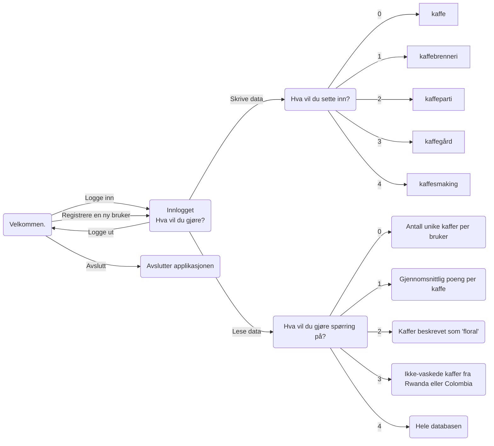
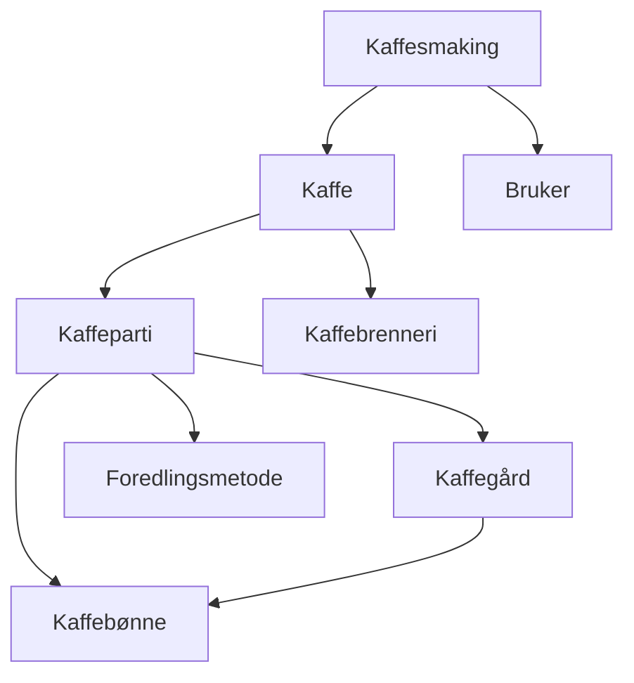

# TDT4145 - DB2 Gruppe 109

| Etternavn  | Fornavn                | E-post                |
| ---------- | ---------------------- | --------------------- |
| Lie        | Karin Sofie Syversveen | kslie@stud.ntnu.no    |
| Stabell    | Karoline Ytreeide      | karoliys@stud.ntnu.no |
| Tenstad    | Magne Erlendsønn       | magneet@stud.ntnu.no  |

## Sjekkliste
- [ ] Brukerhistorie 1
- [ ] Brukerhistorie 2 med SQL-spørring og data for å teste spørringen
- [ ] Brukerhistorie 3 med SQL-spørring og data for å teste spørringen
- [x] Brukerhistorie 4 med SQL-spørring og data for å teste spørringen
- [x] Brukerhistorie 5 med SQL-spørring og data for å teste spørringen
- [x] Notere alle endringer som er gjort fra DB1 (se git history)
- [ ] Skrive og begrunne antakelser
- [ ] Forklare hvordan programmet kjøres og brukes

## Evalueringskriterier
- [ ] En oversikt over hvordan brukerhistoriene er løst.
- [ ] Korrekt bruk av SQL i Python.
- [ ] Forståelig og lesbar kode.
- [ ] Konsise og tydelige beskrivelser i dokumentet
- [ ] Det skal være mulig å reprodusere de leverte resultatene ved hjelp av programmet og databasen som er levert.

## Applikasjonsbeskrivelse

### Endringer i struktur og antakelser

#### Endringer i struktur (SQL)
- Endret Innhøstingsår fra TEXT til INTEGER for å få rett validering av input.
- La til Beskrivelse attributt på kaffe da dette var blitt glemt.
- Byttet ut æ, ø og å med ae, oe og aa i alle attributtnavn da det ga feilmelding.
- Kaffegårder må dyrke minst en kaffebønne.

#### Antakelser
- I brukerhistorie 2 har vi antatt at brukere som ikke har smakt noen kaffer ikke skal vises i tabellen.


#### Hvordan kardinalitet implementeres
Kardinalitet for de ulike relasjonene implementeres ved hjelp av RDB-skjemaene. I de tilfeller det er én til mange har den entiteten som bare kan ha en relasjon til den andre entiteten en fremmednøkkel. 

I de tilfellene hvor det kan opprettes flere relasjoner mellom entitetene, er lagres de to fremmednøklene i en tabell. 

### Hvordan kjøre programmet

Programmet er skrevet med python 3.10 og er ikke testet for andre versjoner av python.

Installer `pandas` og `tabulate` dersom du ikke allerede har det.
```
pip install pandas
pip install tabulate
```
Gå til `src`-mappen dersom du ikke allerede er der.
```
cd db2/src
```
Kjør følgende kommando for å kjøre programmet.
```
python main.py
```
Kjør følgende kommando for å kjøre automatiske tester.
```
python -m unittest test.py
```
Hver gang det presenteres alternativer, velger man et alternativ ved å skrive nummeret som står foran alternativet.

### Hvordan applikasjonen fungerer


<b>Figur 1: Tilstandsdiagram for applikasjonen</b>

Brukeren får mulighet til å logge inn eller registrere en ny bruker. Ved oppstart må det opprettes en bruker for å få logget inn. Deretter blir man spurt hva man ønsker å gjøre, og får tre alternativer: skrive data, lese data eller avslutte programmet. Ved valg av alternativ kan man enten skrive inn nummeret på valget, eller skrive selve valget.

Figur 2 viser hvordan ulike objekter i databasen er avhengige av andre objekter. Når man skal skrive inn data for disse tilfellene kan man velge å bruke data som allerede ligger i tabellen, eller legge til ny. Dersom man ønsker å legge til ny data må det også legges til data for eventuelle avhengigheter. Om en bruker for eksempel ønsker å legge til en kaffesmaking, må en kaffe velges eller opprettes. Ved hver avhengighet blir alternativene som ligger i databasen presentert, og det kan velges blant de lagrede eller legges til en ny. 


<b>Figur 2: Avhengigheter mellom tabellene i databasen</b>

#### Implementasjon av brukerhistorie 1
Etter at applikasjonen er startet implementeres brukerhistorie 1 ved å gjøre følgende:
1. Velg alternativ (1) 'Registrere ny bruker' ved spørsmålet 'Hva vil du gjøre?'
2. Fyll inn feltene som dukker opp med ønsket informasjon (Epost, passord, fullt navn og land). Du logges automatisk inn.
3. Du blir nå presentert med 3 alternativer, og velger alternativ (0) 'Skrive data'. 
4. Du får fem nye alternativer og velger alternativ (4) 'Kaffesmaking' for å legge til en ny kaffesmaking.
5. Dersom kaffen du har smakt ikke eksisterer velger du alternativ (4) 'Ingen av disse', og får muligheten til å legge til en ny kaffe. 
6. Fyller inn KaffebrenneriNavn, KaffeNavn, Brenningsdato, Brenningsgrad, Beskrivelse og Kilopris for Kaffen. 
7. Deretter må en velge kaffeparti eller opprette et nytt et


Ved implementasjon av brukerhistorie én må man først registrere en ny bruker med epost, passord, fullt navn og land. Da er man logget inn, og får spørsmålet om hva man ønsker å gjøre. For brukerhistorie

er implementert under 'Skrive data'. Her får brukeren fem valgmuligheter: 
- Legge til kaffe
- Legge til kaffebrenneri
- Legge til kaffeparti
- Legge til kaffegård
- Legge til kaffesmaking


#### Implementasjon av brukerhistorie 2-5

Etter å ha logget inn får man velge mellom 'Skrive data', 'Lese data' og 'Logge ut'. Brukerhistorie 2-5 er implementert under 'Lese data'. Her får man mulighet til å velge mellom de fire ulike spørringene, samt et femte alternativ der man får se alt som ligger i databasen. Se figur 1.

Spørringen fra brukerhistorie 2 finnes under alternativ 0: 'Antall unike kaffer'. Spørringen returnerer brukernes fulle navn og antallet kaffer de har smakt.

Spørringen fra brukerhistorie 3 finnes under alternativ 1: 'Gjennomsnittlig poeng per kaffe' og returnerer en liste med kaffebrennerinavn, kaffenavn, pris og gjennomsnittsscore for hver kaffe, med høyest gjennomsnittsscore. 

Spørringen fra brukerhistorie 4 finnes under alternativ 2: 'Kaffer beskrevet som 'floral'' og returnerer en liste med kaffebrennerinavn og kaffenavn. 

Spørringen fra brukerhistorie 5 finnes under alternativ 3: 'Ikke-vaskede kaffer fra Rwanda eller Colombia' og returnerer en liste over kafferbrennerinavn og kaffenavn.
