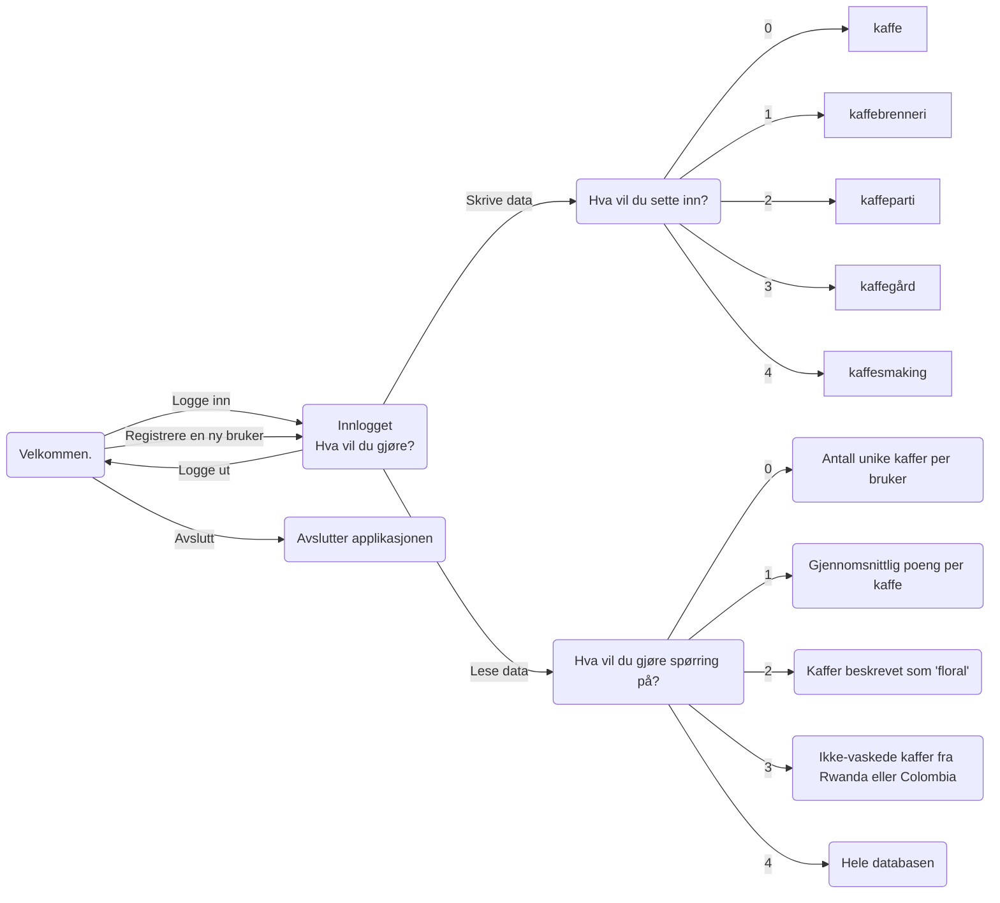
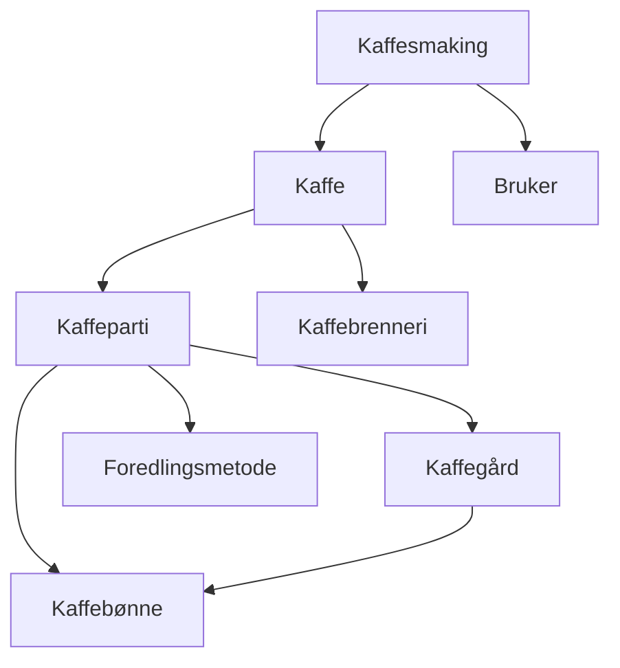

# TDT4145 - DB2 Gruppe 109

| Etternavn  | Fornavn                | E-post                |
| ---------- | ---------------------- | --------------------- |
| Lie        | Karin Sofie Syversveen | kslie@stud.ntnu.no    |
| Stabell    | Karoline Ytreeide      | karoliys@stud.ntnu.no |
| Tenstad    | Magne Erlendsønn       | magneet@stud.ntnu.no  |

## Sjekkliste
- [ ] Brukerhistorie 1
- [ ] Brukerhistorie 2 med SQL-spørring og data for å teste spørringen
- [ ] Brukerhistorie 3 med SQL-spørring og data for å teste spørringen
- [x] Brukerhistorie 4 med SQL-spørring og data for å teste spørringen
- [x] Brukerhistorie 5 med SQL-spørring og data for å teste spørringen
- [x] Notere alle endringer som er gjort fra DB1 (se git history)
- [ ] Skrive og begrunne antakelser
- [ ] Forklare hvordan programmet kjøres og brukes

## Evalueringskriterier
- [ ] En oversikt over hvordan brukerhistoriene er løst.
- [ ] Korrekt bruk av SQL i Python.
- [ ] Forståelig og lesbar kode.
- [ ] Konsise og tydelige beskrivelser i dokumentet
- [ ] Det skal være mulig å reprodusere de leverte resultatene ved hjelp av programmet og databasen som er levert.

## Applikasjonsbeskrivelse

### Endringer i struktur og antakelser

#### Endringer i struktur (SQL)
- Endret Innhøstingsår fra TEXT til INTEGER for å få rett validering av input.
- La til Beskrivelse attributt på kaffe da dette var blitt glemt.
- Byttet ut æ, ø og å med ae, oe og aa i alle attributtnavn da det ga feilmelding.
- Kaffegårder må dyrke minst en kaffebønne.

#### Antakelser
- I brukerhistorie 2 har vi antatt at brukere som ikke har smakt noen kaffer ikke skal vises i tabellen.


#### Hvordan kardinalitet implementeres
Kardinalitet for de ulike relasjonene implementeres ved hjelp av RDB-skjemaene. I de tilfeller det er én til mange har den entiteten som bare kan ha en relasjon til den andre entiteten en fremmednøkkel. 

I de tilfellene hvor det kan opprettes flere relasjoner mellom entitetene, er lagres de to fremmednøklene i en tabell. 

### Hvordan kjøre programmet

Programmet er skrevet med python 3.10 og er ikke testet for andre versjoner av python.

Installer `pandas` og `tabulate` dersom du ikke allerede har det.
```
pip install pandas
pip install tabulate
```
Gå til `src`-mappen dersom du ikke allerede er der.
```
cd db2/src
```
Kjør følgende kommando for å kjøre programmet.
```
python main.py
```
Kjør følgende kommando for å kjøre automatiske tester.
```
python -m unittest test.py
```
Hver gang det presenteres alternativer, velger man et alternativ ved å skrive nummeret som står foran alternativet.

### Hvordan applikasjonen fungerer


<b>Figur 1: Tilstandsdiagram for applikasjonen</b>

Brukeren får mulighet til å logge inn eller registrere en ny bruker. Ved oppstart må det opprettes en bruker for å få logget inn. Deretter blir man spurt hva man ønsker å gjøre, og får tre alternativer: skrive data, lese data eller avslutte programmet. Ved valg av alternativ kan man enten skrive inn nummeret på valget, eller skrive selve valget.

Figur 2 viser hvordan ulike objekter i databasen er avhengige av andre objekter. Når man skal skrive inn data for disse tilfellene kan man velge å bruke data som allerede ligger i tabellen, eller legge til ny. Dersom man ønsker å legge til ny data må det også legges til data for eventuelle avhengigheter. Om en bruker for eksempel ønsker å legge til en kaffesmaking, må en kaffe velges eller opprettes. Ved hver avhengighet blir alternativene som ligger i databasen presentert, og det kan velges blant de lagrede eller legges til en ny. 


<b>Figur 2: Avhengigheter mellom tabellene i databasen</b>

#### Implementasjon av brukerhistorie 1
Etter at applikasjonen er startet implementeres brukerhistorie 1 ved å gjøre følgende:
1. Velg alternativ (1) 'Registrere ny bruker' ved spørsmålet 'Hva vil du gjøre?'
2. Fyll inn feltene som dukker opp med ønsket informasjon (Epost, passord, fullt navn og land). Du logges automatisk inn.
3. Du blir nå presentert med 3 alternativer, og velger alternativ (0) 'Skrive data'. 
4. Du får fem nye alternativer og velger alternativ (4) 'Kaffesmaking' for å legge til en ny kaffesmaking.
5. Dersom kaffen du har smakt ikke eksisterer velger du alternativ (4) 'Ingen av disse'. 
6. Fyll inn KaffebrenneriNavn, KaffeNavn, Brenningsdato, Brenningsgrad, Beskrivelse og Kilopris for Kaffen. 
7. Oppgi hvilket kaffeparti kaffen er laget av ved å velge et eksisterende kaffeparti eller opprette et nytt. Et nytt kaffeparti opprettes ved å velge alternativ (3) 'Ingen av disse'.
8. Ved oppretting av et nytt kaffeparti fylles innhøstingsår og kilopris for partiet inn. 
9. Oppgi hvilken kaffegård kaffepartiet kommer fra ved å velge en eksisterende kaffeparti eller opprette en ny. En ny kaffegård kan opprettes ved å velge alternativ (3) 'Ingen av disse'.
10. Ved oppretting av en ny kaffegård oppgis navn på gården, høyde over havet, land og region. Deretter oppgis det hvilke(n) av tre typer kaffebønner som produseres ved gården.
11. Oppgi hvilken foredlingsmetode som er benyttet ved å velge blant eksisterende foredlingsmetoder eller opprette en ny ved å velge alternativ (2) 'Ingen av disse'. En foredlingsmetode opprettes ved å fylle inn navn og beskrivelse.
12. Deretter velger man hvilke kaffebønner kaffepartiet består av, blant de gården produserer
13. Til slutt fyller en inn følgende verdier for kaffesmakingen: smaksnotater, poeng (fra 0 til 10) og smaksdato.
14. Gå tilbake tilbake til menyen over til "Hva vil du gjøre?"-menyen ved å velge alternativ (1) 'Nei' på spørsmålet om du ønsker å sette inn noe mer.


#### Implementasjon av brukerhistorie 2-5

Etter å ha logget inn får man velge mellom 'Skrive data', 'Lese data' og 'Logge ut'. Brukerhistorie 2-5 er implementert under 'Lese data'. Her får man mulighet til å velge mellom de fire ulike spørringene, samt et femte alternativ der man får se alt som ligger i databasen. Se figur 1.

Spørringen fra brukerhistorie 2 finnes under alternativ 0: 'Antall unike kaffer'. Spørringen returnerer brukernes fulle navn og antallet kaffer de har smakt.

Spørringen fra brukerhistorie 3 finnes under alternativ 1: 'Gjennomsnittlig poeng per kaffe' og returnerer en liste med kaffebrennerinavn, kaffenavn, pris og gjennomsnittsscore for hver kaffe, med høyest gjennomsnittsscore. 

Spørringen fra brukerhistorie 4 finnes under alternativ 2: 'Kaffer beskrevet som 'floral'' og returnerer en liste med kaffebrennerinavn og kaffenavn. 

Spørringen fra brukerhistorie 5 finnes under alternativ 3: 'Ikke-vaskede kaffer fra Rwanda eller Colombia' og returnerer en liste over kafferbrennerinavn og kaffenavn.

## Brukerhistorier v2

### Brukerhistorie 1
Brukerhistorie 1 går ut på å notere en kaffesmaking, og krever at den aktuelle brukeren er logget inn. Vi registrerer derfor en bruker før vi notererer kaffesmakingen. 
```
Velkommen til Kaffedatabasen 😊☕   

Hva vil du gjøre?
        (0) Logge inn
        (1) Logge inn som gjest    
        (2) Registrere en ny bruker
        (3) Avslutte
> registrere en ny bruker

Registrer deg med epost, passord, navn og land:

<str> Epost: bruker@ntnu.no
<str> Passord: bruker-passord
<str> Fullt navn: Bruker Bruker                  
<str> Land: Brukerland

✅ Satt inn brukeren ['bruker@ntnu.no', 'bruker-passord', 'Bruker Bruker', 'Brukerland'] 

Registrert og logget inn som bruker@ntnu.no!

Hva vil du gjøre?
        (0) Lese data
        (1) Logge ut
        (2) Skrive data
> skrive data

Hva vil du sette inn?
        (0) Kaffe
        (1) Kaffebrenneri        
        (2) Kaffeparti
        (3) Kaffegård
        (4) Kaffesmaking
        (5) Ingenting, gå tilbake
> kaffesmaking

Hvilken kaffe har du smakt?
        (0) ('Jacobsen & Svart', 'Vinterkaffe', '2022.20.01', 'lysbrent', 'En velsmakende og kompleks kaffe for mørketiden.', 600.0, '0')   
        (1) ('Jacobsen & Svart', 'Diamond Santos', '2021.02.01', 'lysbrent', 'En temmelig stabil og streit kaffe.', 349.0, '1')
        (2) ('Jacobsen & Svart', 'La Palma', '2021.02.01', 'lysbrent', 'Forfriskende og delikat.', 598.0, '2')
        (3) ('Realfagsbrenneriet', 'Data-kaffe', '2021.02.01', 'mørkbrent', 'En kaffe for datateknologi-studenter.', 600.0, '3')
        (4) ('Realfagsbrenneriet', 'Kyb-kaffe', '2022.01.02', 'lysbrent', 'En kaffe for kybernetikk-studenter.', 412.0, '4')
        (5) ('Realfagsbrenneriet', 'Indøk-kaffe', '2022.02.12', 'lysbrent', 'En kaffe for indøk-studenter.', 789.0, '5')
        (6) ('Realfagsbrenneriet', 'I&IKT-kaffe', '2022.03.12', 'mørkbrent', 'En kaffe for ingeniørvitenskap-og-ikt-studenter.', 359.0, '6')
        (7) Ingen av disse.
> 0

Fyll inn følgende verdier for kaffesmakingen.

<str> Smaksnotater: Wow - en odyssé for smaksløkene: sitrusskall, melkesjokolade, aprikos!
<int> Poeng: 10
<Date> Smaksdato (yyyy.mm.dd): 2022.03.24

✅ Satt inn kaffesmakingen ['bruker@ntnu.no', 'Jacobsen & Svart', 'Vinterkaffe',
'Wow - en odyssé for smaksløkene: sitrusskall, melkesjokolade, aprikos!', 10, '2022.03.24'] 

Vil du sette inn noe mer?
        (0) Ja
        (1) Nei
> nei

Hva vil du gjøre?
        (0) Lese data
        (1) Logge ut
        (2) Skrive data
> logge ut

Logget ut.

Velkommen til Kaffedatabasen 😊☕

Hva vil du gjøre?
        (0) Logge inn
        (1) Logge inn som gjest
        (2) Registrere en ny bruker
        (3) Avslutte
> avslutte

Takk for nå!
```

### Brukerhistorie 2 - 5
Brukerhistorie 2 - 5 går alle ut på å gjøre spørringer på databasen. Dette krever *ikke* at man har en registrert bruker, og vi logger derfor inn som gjest.

```
Velkommen til Kaffedatabasen 😊☕   

Hva vil du gjøre?
        (0) Logge inn
        (1) Logge inn som gjest    
        (2) Registrere en ny bruker
        (3) Avslutte
> logge inn som gjest

Logget inn som 'guest'

Hva vil du gjøre?     
        (0) Lese data 
        (1) Logge ut  
> lese data
```

#### Brukerhistorie 2
```
Hva vil du gjøre spørring på?
        (0) Alle kaffesmakinger
        (1) Flest unike kaffer i år
        (2) Mest for pengene
        (3) Beskrevet som floral
        (4) Ikke vasket fra Rwanda eller Colombia
        (5) Hele databasen
> flest unike kaffer i år

Resultatet ble:

| FulltNavn                |   Antall |
|:-------------------------|---------:|
| Magne Erlendsønn Tenstad |        7 |
| Bruker Bruker            |        1 |

Vil du gjøre en ny spørring?
        (0) Ja
        (1) Nei
> ja 
```

### Brukerhistorie 3
```
Hva vil du gjøre spørring på?
        (0) Alle kaffesmakinger
        (1) Flest unike kaffer i år
        (2) Mest for pengene
        (3) Beskrevet som floral
        (4) Ikke vasket fra Rwanda eller Colombia
        (5) Hele databasen
> mest for pengene

Resultatet ble:

| KaffebrenneriNavn   | Navn           |   Kilopris |   GjPoeng |
|:--------------------|:---------------|-----------:|----------:|
| Jacobsen & Svart    | Diamond Santos |        349 |       7   |
| Realfagsbrenneriet  | I&IKT-kaffe    |        359 |       6   |
| Realfagsbrenneriet  | Data-kaffe     |        600 |      10   |
| Jacobsen & Svart    | La Palma       |        598 |       8   |
| Jacobsen & Svart    | Vinterkaffe    |        600 |       6.5 |
| Realfagsbrenneriet  | Kyb-kaffe      |        412 |       4   |
| Realfagsbrenneriet  | Indøk-kaffe    |        789 |       2   |

Vil du gjøre en ny spørring?
        (0) Ja
        (1) Nei
> ja
```

### Brukerhistorie 4
```
Hva vil du gjøre spørring på?
        (0) Alle kaffesmakinger
        (1) Flest unike kaffer i år
        (2) Mest for pengene
        (3) Beskrevet som floral
        (4) Ikke vasket fra Rwanda eller Colombia
        (5) Hele databasen
> beskrevet som floral

Resultatet ble:

| KaffebrenneriNavn   | Navn     |
|:--------------------|:---------|
| Jacobsen & Svart    | La Palma |

Vil du gjøre en ny spørring?
        (0) Ja
        (1) Nei
> ja
```

### Brukerhistorie 5
```
Hva vil du gjøre spørring på?
        (0) Alle kaffesmakinger
        (1) Flest unike kaffer i år
        (2) Mest for pengene
        (3) Beskrevet som floral
        (4) Ikke vasket fra Rwanda eller Colombia
        (5) Hele databasen
> ikke vasket fra rwanda eller colombia

Resultatet ble:

| Navn       | KaffebrenneriNavn   |
|:-----------|:--------------------|
| Data-kaffe | Realfagsbrenneriet  |
| Kyb-kaffe  | Realfagsbrenneriet  |

Vil du gjøre en ny spørring?
        (0) Ja
        (1) Nei
> nei

Hva vil du gjøre?
        (0) Lese data
        (1) Logge ut
> logge ut

Logget ut.

Velkommen til Kaffedatabasen 😊☕

Hva vil du gjøre?
        (0) Logge inn
        (1) Logge inn som gjest
        (2) Registrere en ny bruker
        (3) Avslutte
> avslutte

Takk for nå!
```
