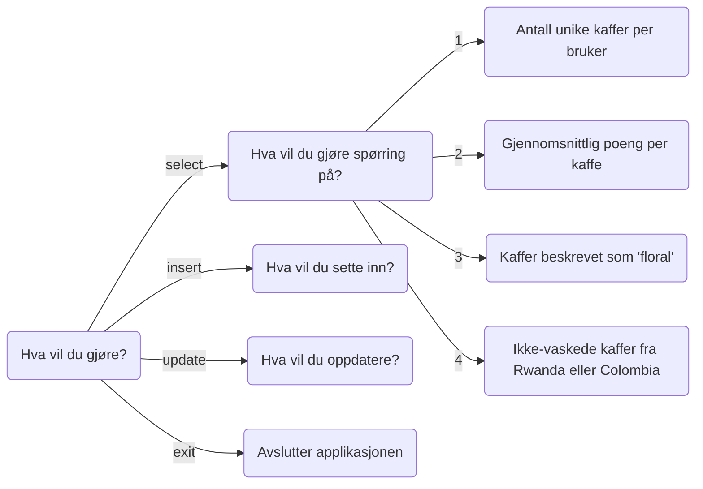

# TDT4145 - DB2 Gruppe 109

| Etternavn  | Fornavn                | E-post                |
| ---------- | ---------------------- | --------------------- |
| Lie        | Karin Sofie Syversveen | kslie@stud.ntnu.no    |
| Stabell    | Karoline Ytreeide      | karoliys@stud.ntnu.no |
| Tenstad    | Magne Erlendsønn       | magneet@stud.ntnu.no  |

## Sjekkliste
- [ ] Brukerhistorie 1
- [ ] Brukerhistorie 2 med SQL-spørring og data for å teste spørringen
- [ ] Brukerhistorie 3 med SQL-spørring og data for å teste spørringen
- [ ] Brukerhistorie 4 med SQL-spørring og data for å teste spørringen
- [ ] Brukerhistorie 5 med SQL-spørring og data for å teste spørringen

## Evalueringskriterier
- [ ] En oversikt over hvordan brukerhistoriene er løst.
- [ ] Korrekt bruk av SQL i Python.
- [ ] Forståelig og lesbar kode.
- [ ] Konsise og tydelige beskrivelser i dokumentet
- [ ] Det skal være mulig å reprodusere de leverte resultatene ved hjelp av programmet og databasen som er levert.

## Applikasjonsbeskrivelse

TODO: Registrere og logge inn som bruker eller admin.

